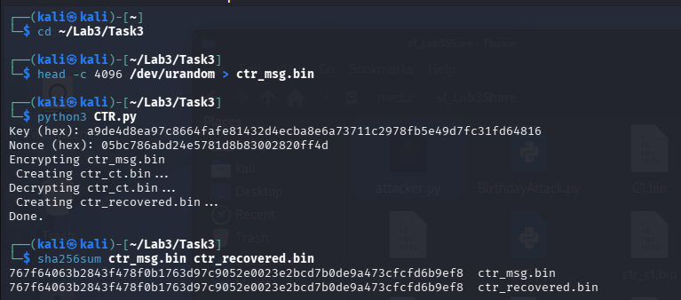
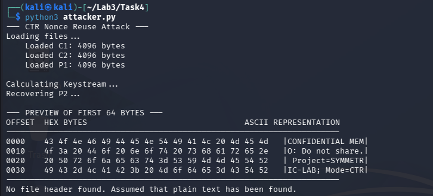
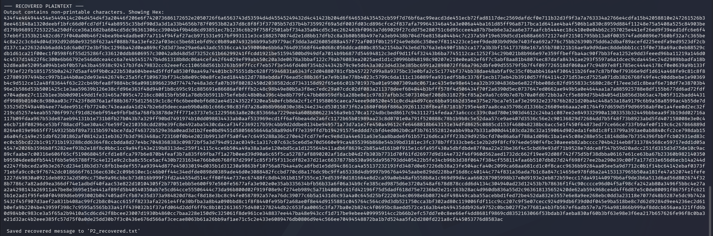
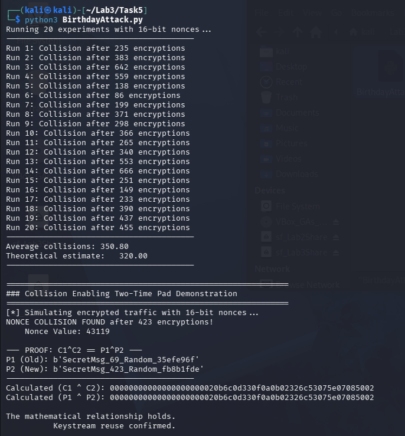

# Lab 3 — Symmetric Encryption: Block Ciphers, IND-CPA, AEAD & Cryptographic Failures

**Course:** CSCI/CSCY 4407 — Security & Cryptography
**Semester:** Spring 2026
**Date:** [DATE]
**Group Members:** [NAMES]

---

## Task 1 — ECB Distinguisher (15 pts)

### Source Code

```python
# [PASTE ECB ENCRYPTION + DISTINGUISHER CODE HERE]
```

### Repeated Ciphertext Block Evidence

[INSERT SCREENSHOT: Ciphertext output showing duplicate 16-byte blocks for P0 (repeated plaintext)]

```
# [PASTE HEX OUTPUT OR BLOCK COMPARISON HERE]
```

### Trial Results Table (≥ 20 Trials)

| Trial | b (chosen) | b' (guessed) | Correct? |
|-------|-----------|--------------|----------|
| 1     |           |              |          |
| 2     |           |              |          |
| 3     |           |              |          |
| 4     |           |              |          |
| 5     |           |              |          |
| 6     |           |              |          |
| 7     |           |              |          |
| 8     |           |              |          |
| 9     |           |              |          |
| 10    |           |              |          |
| 11    |           |              |          |
| 12    |           |              |          |
| 13    |           |              |          |
| 14    |           |              |          |
| 15    |           |              |          |
| 16    |           |              |          |
| 17    |           |              |          |
| 18    |           |              |          |
| 19    |           |              |          |
| 20    |           |              |          |

### Success Rate and Advantage

**Number of correct guesses:** [X / 20]

**Success Rate:** [X / 20 = X%]

**IND-CPA Advantage:**

```
Adv_IND-CPA = |Pr[b' = b] - 1/2| = [VALUE]
```

### Explanation: Why ECB Violates Semantic Security

[EXPLAIN why ECB is deterministic (C_i = E_k(P_i)) and why identical plaintext blocks always produce identical ciphertext blocks. Explain why this pattern leakage means an adversary can distinguish encryptions of different messages, and therefore ECB fails IND-CPA.]

---

## Task 2 — CBC IV Experiment (15 pts)

### Source Code

```python
# [PASTE CBC ENCRYPTION/DECRYPTION CODE WITH PKCS#7 PADDING HERE]
```

### Evidence: Fresh IV → Different Ciphertext

[INSERT SCREENSHOT: Two encryptions of the same plaintext under different IVs producing different ciphertexts]

```
# [PASTE SHA-256 HASHES OF BOTH CIPHERTEXTS HERE — THEY SHOULD DIFFER]
SHA-256(C_fresh_1): [HASH]
SHA-256(C_fresh_2): [HASH]
```

### Evidence: Reused IV → Linkability

[INSERT SCREENSHOT: Two encryptions under the same IV producing the same or linkable ciphertext]

```
# [PASTE SHA-256 HASHES OF BOTH CIPHERTEXTS HERE — THEY SHOULD MATCH]
SHA-256(C_reused_1): [HASH]
SHA-256(C_reused_2): [HASH]
```

### Decryption Verification (SHA-256)

```
SHA-256(original plaintext): [HASH]
SHA-256(decrypted plaintext): [HASH]
Match: [YES/NO]
```

### Explanation: Why a Fresh IV Is Required

[EXPLAIN that CBC chains each block as C_i = E_k(P_i XOR C_{i-1}) with C_0 = IV. If the IV is reused with the same key and same plaintext, the ciphertext is identical — leaking that the same message was sent. Even with different plaintexts, a reused IV allows an attacker to detect when the first block is the same. A fresh random IV per encryption ensures ciphertexts are unlinkable and semantically secure.]

---

## Task 3 — CTR Implementation (10 pts)

### Source Code

```python
import os
from cryptography.hazmat.primitives.ciphers import Cipher, algorithms, modes
from cryptography.hazmat.backends import default_backend

def GetAESCTRCipher(key, nonce):
    #AES-CTR needs a 16-byte nonce (This functions as our initial counter block)
    return Cipher(algorithms.AES(key), modes.CTR(nonce), backend=default_backend())

def FileEncryption(input_file, output_file, key, nonce):
    Cipher = GetAESCTRCipher(key, nonce)
    Encryptor = Cipher.encryptor()
    
    with open(input_file, 'rb') as f_in:
        Plaintext = f_in.read()
        
    CipherText = Encryptor.update(Plaintext) + Encryptor.finalize()
    
    with open(output_file, 'wb') as f_out:
        f_out.write(CipherText)

def FileDecryption(input_file, output_file, key, nonce):
    Cipher = GetAESCTRCipher(key, nonce)
    Decryptor = Cipher.decryptor()
    
    with open(input_file, 'rb') as f_in:
        CipherText = f_in.read()
        
    PlainText = Decryptor.update(CipherText) + Decryptor.finalize()
    
    with open(output_file, 'wb') as f_out:
        f_out.write(PlainText)

if __name__ == "__main__":
    #Generates a Key (32 bytes for AES-256) and a Nonce (16 bytes)
    key = os.urandom(32)
    nonce = os.urandom(16)
    
    print(f"Key (hex): {key.hex()}")
    print(f"Nonce (hex): {nonce.hex()}")

    #Encrypts
    print("Encrypting ctr_msg.bin \n Creating ctr_ct.bin...")
    FileEncryption("ctr_msg.bin", "ctr_ct.bin", key, nonce)

    #Decrypts
    print("Decrypting ctr_ct.bin... \n Creating ctr_recovered.bin...")
    FileDecryption("ctr_ct.bin", "ctr_recovered.bin", key, nonce)
    
    print("Done.")
```

### Key and Nonce Details

| Parameter | Size | Value |
|-----------|------|-------|
| Key       | 32 bytes | a9de4d8ea97c8664fafe81432d4ecba8e6a73711c2978fb5e49d7fc31fd64816 |
| Nonce     | 16 bytes | 05bc786abd24e5781d8b83002820ff4d |
| Test file | 4096 bytes | — |

### Encryption and Decryption Output



### SHA-256 Hash Verification

```
SHA-256(original file):   767f64063b2843f478f0b1763d97c9052e0023e2bcd7b0de9a473cfcfd6b9ef8
SHA-256(decrypted file):  767f64063b2843f478f0b1763d97c9052e0023e2bcd7b0de9a473cfcfd6b9ef8
Match: Yes
```

### Explanation: Why CTR Behaves Like a Stream Cipher
AES-CTR transforms a block cipher into a stream cipher; instead of encrypting the plaintext directly the block cipher encrypts a unique input block consisting of a Nonce and a Counter (IV=Nonce∣∣Counteri​). This produces a stream of pseudorandom bits known as the keystream, the encryption process is the XOR between the plaintext and the keystream: Ci=Pi⊕Ek(Nonce∣∣Counteri) Because the XOR operation is symmetric decryption is identical to encryption. The receiver generates the same keystream and XORs with the ciphertext to recover the plaintext, unlike the CBC mode there is no chaining between the blocks. This allows for parallel processing meaning that multiple blocks can be encrypted or decrypted simultaneously, which is a just how stream ciphers operate.

---

## Task 4 — CTR Nonce Reuse Attack (20 pts)

### Group Ciphertext Package

**Group number:** 10
**Files used:** [LIST FILENAMES FROM GROUP PACKAGE]

### XOR Script

```python
import sys

def XORByter(b1, b2):
    """XORs two strings together, and then returns bytes."""
    #We use zip to XOR byte by byte, then the length will be the shorter of the two.
    return bytes([x ^ y for x, y in zip(b1, b2)])
    
def HexExtractionPreview(data, length=64):
    """Prints a hexdump-style preview of the data (Hex + ASCII)."""
    print(f"\n--- PREVIEW OF FIRST {length} BYTES ---")
    print("OFFSET  HEX BYTES                                 ASCII REPRESENTATION")
    print("-" * 70)
    
    # Take only the first 'length' bytes
    chunk = data[:length]
    
    # Process in rows of 16 bytes
    for i in range(0, len(chunk), 16):
        row = chunk[i:i+16]
        
        # Hex section
        hex_vals = ' '.join(f"{b:02x}" for b in row)
        
        # ASCII section (replace unprintable chars with '.')
        ascii_vals = ''.join(chr(b) if 32 <= b <= 126 else '.' for b in row)
        
        # Print formatted row
        print(f"{i:04x}    {hex_vals:<48}  |{ascii_vals}|")
    print("-" * 70)

def main():
    print("--- CTR Nonce Reuse Attack ---")

    #Loads the file provided C1, C2, P1
    try:
        print("Loading files...")
        with open("C1.bin", "rb") as f: 
            C1 = f.read()
        with open("C2.bin", "rb") as f: 
            C2 = f.read()
        with open("P1.bin", "rb") as f: 
            P1 = f.read()
            
        print(f"    Loaded C1: {len(C1)} bytes")
        print(f"    Loaded C2: {len(C2)} bytes")
        print(f"    Loaded P1: {len(P1)} bytes")

    except FileNotFoundError as e:
        print(f"\n Error: {e}")
        print("Make sure C1.bin, C2.bin, and P1.bin are in this folder.")
        return

    #Verify the string lengths
    MinimumLength = min(len(C1), len(C2), len(P1))
    
    #Trim to the minimum length to avoid overflow
    C1 = C1[:MinimumLength]
    C2 = C2[:MinimumLength]
    P1 = P1[:MinimumLength]

    #Attack
    print("\nCalculating Keystream...")
    KeyStream = XORByter(C1, P1)

    print("Recovering P2...")
    P2 = XORByter(C2, KeyStream)
    
    hexdump_preview(P2)
    
    #Check for common file signatures automatically
    if P2.startswith(b'%PDF'):
        print("[!] DETECTED PDF FILE HEADER!")
    elif P2.startswith(b'\x89PNG'):
        print("[!] DETECTED PNG IMAGE HEADER!")
    elif P2.startswith(b'\xff\xd8\xff'):
        print("[!] DETECTED JPEG IMAGE HEADER!")
    else:
        print("No file header found. Assumed that plain text has been found.")

    #Display results
    print("\n--- RECOVERED PLAINTEXT ---")
    try:
        #Print as text
        print(P2.decode('utf-8'))
    except UnicodeDecodeError:
        #If it contains non-printable characters show them in hex instead
        print("Output contains non-printable characters. Showing Hex:")
        print(P2.hex())

    #Save the result
    with open("P2_recovered.txt", "wb") as f:
        f.write(P2)
    print("\n Saved recovered message to 'P2_recovered.txt'")
    
if __name__ == "__main__": 
    main()
```

### XOR Output Evidence




### Recovered Plaintext (of readable text at top of P2 file)

| Offset | Hex Bytes                                       | Recovered Text   |
|--------|-------------------------------------------------|------------------|
| 0000   | 43 4f 4e 46 49 44 45 4e 54 49 41 4c 20 4d 45 4d | CONFIDENTIAL MEM |
| 0010   | 4f 3a 20 44 6f 20 6e 6f 74 20 73 68 61 72 65 2e | o: Do not share. |
| 0020   | 20 50 72 6f 6a 65 63 74 3d 53 59 4d 4d 45 54 52 | Project=SYMMETR  |
| 0030   | 49 43 2d 4c 41 42 3b 20 4d 6f 64 65 3d 43 54 52 | IC-LAB; Mode=CTR |

### Explanation of Keystream Reuse

**Violated assumption: nonce uniqueness** — CTR mode is secure only when every (key, nonce) pair is used for exactly one encryption; reusing the same nonce with the same key directly violates this assumption and renders the scheme insecure.  
When a nonce is reused with the same key the input to the encryption is identical. Since AES is a deterministic function it produces the exact same output (the keystream) for both messages. When two different plaintexts (P1 and P2) are encrypted using this identical keystream, the security falls in on it self. If an attacker captures both ciphertexts (C1 and C2) and XORs them together, the keystream cancels out entirely: C1⊕C2=(P1⊕K)⊕(P2⊕K)=P1⊕P2⊕(K⊕K)=P1⊕P2​. This leaves the attacker with the XOR of the two plaintexts, effectively removing the encryption layer. This creates a classic "Two-Time Pad" vulnerability, where known-plaintext attacks or statistical analysis (crib dragging) can recover the original messages.

### Mathematical Explanation of Two-Time Pad Failure

In the One-Time Pad or stream cipher model, perfect secrecy requires the key (or keystream) to be random. the same lenght as the message, and never reused. The math below demonstrates why reuse is catastrophic:

Let K be the keystream generated by the encryption(Nonce∣∣Counter).

Encryption 1: C1=P1⊕K
Encryption 2: C2=P2⊕K

When an adversary intercepts C1 and C2​ they can compute their XOR sum (X): X=C1⊕C2 and then with substituting the encryption equations: X=(P1⊕K)⊕(P2⊕K). Due to the associative and commutative properties of XOR, we can rearrange the terms: X=P1⊕P2⊕(K⊕K) and then since any value XORed with itself is zero we get X=P1⊕P2⊕0  X=P1⊕P2. ​The keystream (K) has been mathematically eliminated, if the attacker possesses a known plaintext (P1), they can immediately recover the second message (P2) by computing: P2=X⊕P1
​

---

## Task 5 — Birthday Attack on CTR (15 pts)

### Source Code

```python
import os
import secrets
from cryptography.hazmat.primitives.ciphers import Cipher, algorithms, modes
from cryptography.hazmat.backends import default_backend

# --- Helper Functions for Encryption & XOR ---

def AESCTREncryption(key, NonceInteger, Plaintext):
    """Encrypts data using AES-CTR with a 16-bit nonce converted to bytes."""
    NonceBytes = NonceInteger.to_bytes(16, 'big')
    cipher = Cipher(algorithms.AES(key), modes.CTR(NonceBytes), backend=default_backend())
    Encryptor = cipher.encryptor()
    return Encryptor.update(Plaintext) + Encryptor.finalize()

def XORByter(b1, b2):
    """XORs two byte strings."""
    return bytes([x ^ y for x, y in zip(b1, b2)])

def DemonstrateTwoTimePad(NonceBits=16):
    """
    Simulates encryption to find a collision and proves C1^C2 == P1^P2.
    """
    print("\n" + "="*60)
    print("### Collision Enabling Two-Time Pad Demonstration")
    print("="*60)

    #Use a fixed key for this demonstration system
    SystemKey = os.urandom(32)
    History = {}
    MaxNonceValues = 2**NonceBits
    Trials = 0

    print(f"[*] Simulating encrypted traffic with {NonceBits}-bit nonces...")
    
    while True:
        Trials += 1
        #Generate Nonce
        Nonce = secrets.randbelow(MaxNonceValues)
        
        #Generate a random Plaintext (P2)
        Plaintext = f"SecretMsg_{Trials}_Random_{secrets.token_hex(4)}".encode()
        
        #Encrypt (C2)
        Ciphertext = AESCTREncryption(SystemKey, Nonce, Plaintext)

        #Check for Collision
        if Nonce in History:
            print(f"NONCE COLLISION FOUND after {Trials} encryptions!")
            print(f"    Nonce Value: {Nonce}")
            
            #Retrieve the previous message (P1, C1) that used this nonce
            OldCiphertext, OldPlaintext = History[Nonce]
            
            #Calculate XOR of Ciphertexts and XOR of Plaintexts
            XorCiphertexts = XORByter(OldCiphertext, Ciphertext) # C1 ^ C2
            XorPlaintexts  = XORByter(OldPlaintext, Plaintext)   # P1 ^ P2
            
            print(f"\n--- PROOF: C1^C2 == P1^P2 ---")
            print(f"P1 (Old): {OldPlaintext}")
            print(f"P2 (New): {Plaintext}")
            print("-" * 40)
            print(f"Calculated (C1 ^ C2): {XorCiphertexts.hex()}")
            print(f"Calculated (P1 ^ P2): {XorPlaintexts.hex()}")
            
            if XorCiphertexts == XorPlaintexts:
                print("\nThe mathematical relationship holds.")
                print("          Keystream reuse confirmed.")
            else:
                print("\nFailure has occured")
                
            break #Stop after finding the vulnerability

        #Store for collision checking
        History[Nonce] = (Ciphertext, Plaintext)

def CTRNonce(NonceBits=16):
    """
    Generates random nonces until a collision is found.
    Returns the number of times needed till a collision is found.
    """
    SeenNonces = set()
    Trials = 0
    MaxNonceValues = 2**NonceBits
    
    while True:
        Trials += 1
        #Generates a random integer acting as the nonce
        Nonce = secrets.randbelow(MaxNonceValues)
        
        if Nonce in SeenNonces:
            return Trials #Collision has occured
        
        SeenNonces.add(Nonce)


if __name__ == "__main__":
    NONCE_BITS = 16
    NUM_EXPERIMENTS = 20
    Results = []

    print(f"Running {NUM_EXPERIMENTS} experiments with {NONCE_BITS}-bit nonces...")
    print("-" * 40)

    #Run the Statistical Experiments
    for i in range(NUM_EXPERIMENTS):
        q = CTRNonce(NONCE_BITS)
        Results.append(q)
        print(f"Run {i+1}: Collision after {q} encryptions")

    #Calculate the statistics
    Average = sum(Results) / len(Results)
    Approximation = 1.25 * (2**(NONCE_BITS / 2))

    print("-" * 40)
    print(f"Average collisions: {Average:.2f}")
    print(f"Theoretical estimate:   {Approximation:.2f}")
    print("-" * 40)

    #Run the Demonstration
    DemonstrateTwoTimePad(NONCE_BITS)
```

### Nonce Size Used

**Nonce Bits =** [16 bits]
**Theoretical birthday bound:** q ≈ 1.25 × 2^(Nonce Bits/2) ≈ 320

### Collision Experiment Results (≥ 20 Runs)

| Run | Encryptions Until Collision     |
|-----|---------------------------------|
| 1   | Collision after 106 encryptions |
| 2   | Collision after 274 encryptions |
| 3   | Collision after 68 encryptions |
| 4   | Collision after 325 encryptions |
| 5   | Collision after 478 encryptions |
| 6   | Collision after 581 encryptions |
| 7   | Collision after 303 encryptions |
| 8   | Collision after 371 encryptions |
| 9   | Collision after 182 encryptions |
| 10  | Collision after 128 encryptions |
| 11  | Collision after 170 encryptions |
| 12  | Collision after 563 encryptions |
| 13  | Collision after 504 encryptions |
| 14  | Collision after 705 encryptions |
| 15  | Collision after 331 encryptions |
| 16  | Collision after 517 encryptions |
| 17  | Collision after 383 encryptions |
| 18  | Collision after 383 encryptions |
| 19  | Collision after 302 encryptions |
| 20  | Collision after 161 encryptions |

**Average collision point:** 341.75

### Comparison to Theoretical Birthday Bound

| Metric                            | Value |
|-----------------------------------|-------|
| r (nonce bits)                    | 16    |
| Theoretical bound (1.2 × 2^(r/2)) | 320   |
| Observed average                  | 341.75|
| Difference                        | 21.75 |

The observed average number of trials required to produce a collision was 341.75, this closely aligns with the theoretical birthday bound estimate of 320. The deviation of 21.75 (or 6.8%) is insignificant and is expected due to the nature of the task and the small sample size. Theoretically with more itterations the average would be much closer to the theoretical limit, this result confirms the Birthday Paradox as the collisions occurred in the hundreds range instead of the tens of thousands range demonstrating how quickly a small nonce space is exhausted.

### Collision Enabling Two-Time Pad Demonstration



### Explanation: How Nonce Collision Leads to CTR Insecurity

The security of AES-CTR relies entirely on the uniqueness of the input block (Nonce + Counter) to ensure that the output keystream is unique for every encryption. As demonstrated in Task 5 as the number of our encrypted messages increases, the probability of generating a duplicate nonce increases according to the Birthday Paradox. If a nonce collision occurs while using the same key, the encryption system generates the exact same keystream for two different messages. This collision immediately recreates the conditions of the Two-Time Pad vulnerability mentioned in task 4. Once the collision occurs (C1⊕C2=P1⊕P2) an attacker to bypass the AES encryption entirely and recover plaintext using simple XOR operations. Therefore, nonce uniqueness is not merely a best practice but a hard requirement as without it the confidentiality of CTR fails.

---

## Task 6 — Integrity vs. Confidentiality (AES-GCM) (10 pts)

### Source Code

```python
"""
Task 6 — Integrity vs. Confidentiality (AES-GCM) (10 pts)
============================================================
Demonstrates the difference between confidentiality-only (CBC) and
authenticated encryption (GCM / AEAD).

CBC:
  - Flipping a byte in the ciphertext corrupts the corresponding plaintext block
    and causes predictable bit-flips in the NEXT block — but CBC accepts it silently.
  - No integrity guarantee: tampering is undetected.

GCM (AEAD):
  - The authentication tag T covers the entire ciphertext.
  - Any modification to the ciphertext OR the tag causes decryption to raise
    an InvalidTag exception — tampering is always detected.
"""

import os
from cryptography.hazmat.primitives.ciphers import Cipher, algorithms, modes
from cryptography.hazmat.primitives.ciphers.aead import AESGCM
from cryptography.hazmat.primitives import padding
from cryptography.hazmat.backends import default_backend
from cryptography.exceptions import InvalidTag

KEY_SIZE   = 32   # 256-bit
BLOCK_SIZE = 16
GCM_NONCE_SIZE = 12   # 96-bit recommended for GCM


# ---------------------------------------------------------------------------
# CBC helpers (PKCS#7)
# ---------------------------------------------------------------------------

def pkcs7_pad(data: bytes) -> bytes:
    padder = padding.PKCS7(BLOCK_SIZE * 8).padder()
    return padder.update(data) + padder.finalize()


def pkcs7_unpad(data: bytes) -> bytes:
    unpadder = padding.PKCS7(BLOCK_SIZE * 8).unpadder()
    return unpadder.update(data) + unpadder.finalize()


def cbc_encrypt(key: bytes, iv: bytes, plaintext: bytes) -> bytes:
    padded = pkcs7_pad(plaintext)
    cipher = Cipher(algorithms.AES(key), modes.CBC(iv), backend=default_backend())
    enc = cipher.encryptor()
    return enc.update(padded) + enc.finalize()


def cbc_decrypt(key: bytes, iv: bytes, ciphertext: bytes) -> bytes:
    cipher = Cipher(algorithms.AES(key), modes.CBC(iv), backend=default_backend())
    dec = cipher.decryptor()
    padded = dec.update(ciphertext) + dec.finalize()
    return pkcs7_unpad(padded)


def flip_byte(data: bytes, offset: int) -> bytes:
    """Flip a single byte in data at the given offset."""
    ba = bytearray(data)
    ba[offset] ^= 0xFF
    return bytes(ba)


# ---------------------------------------------------------------------------
# Task 6a: CBC tamper test
# ---------------------------------------------------------------------------

def test_cbc_tamper(key: bytes, plaintext: bytes) -> None:
    print("=== CBC Tamper Test ===")
    iv = os.urandom(BLOCK_SIZE)
    ciphertext = cbc_encrypt(key, iv, plaintext)
    tampered   = flip_byte(ciphertext, offset=0)  # flip first byte

    print(f"  Original  ciphertext[0]: {ciphertext[0]:02x}")
    print(f"  Tampered  ciphertext[0]: {tampered[0]:02x}")

    try:
        recovered = cbc_decrypt(key, iv, tampered)
        print(f"  Decryption succeeded (no authentication check in CBC).")
        print(f"  Original  plaintext (hex): {plaintext[:32].hex()}")
        print(f"  Recovered plaintext (hex): {recovered[:32].hex()}")
        print(f"  Data corruption detected by comparison: {plaintext[:32] != recovered[:32]}")
    except Exception as e:
        print(f"  Decryption raised: {e}")

    print()


# ---------------------------------------------------------------------------
# Task 6b: GCM tamper test
# ---------------------------------------------------------------------------

def test_gcm_tamper(key: bytes, plaintext: bytes) -> None:
    print("=== GCM Tamper Test ===")
    aesgcm = AESGCM(key)
    nonce  = os.urandom(GCM_NONCE_SIZE)
    ciphertext_tag = aesgcm.encrypt(nonce, plaintext, associated_data=None)
    # ciphertext_tag = ciphertext || 16-byte tag

    tampered = flip_byte(ciphertext_tag, offset=0)  # flip one byte in ciphertext

    print(f"  Original  ciphertext_tag[0]: {ciphertext_tag[0]:02x}")
    print(f"  Tampered  ciphertext_tag[0]: {tampered[0]:02x}")

    try:
        aesgcm.decrypt(nonce, tampered, associated_data=None)
        print("  ERROR: Decryption succeeded despite tampering — this should not happen.")
    except InvalidTag:
        print("  InvalidTag exception raised — tampering detected. (expected)")
    except Exception as e:
        print(f"  Unexpected exception: {e}")

    print()


# ---------------------------------------------------------------------------
# Main
# ---------------------------------------------------------------------------

if __name__ == "__main__":
    key       = os.urandom(KEY_SIZE)
    plaintext = b"This is a secret message that must not be tampered with!" * 2

    print(f"Key (hex): {key.hex()}\n")

    test_cbc_tamper(key, plaintext)
    test_gcm_tamper(key, plaintext)

    print("=== Summary ===")
    print("  CBC: accepts tampered ciphertext — corrupts plaintext silently (no integrity).")
    print("  GCM: rejects tampered ciphertext — raises InvalidTag (AEAD = confidentiality + integrity).")

```

### CBC Tamper Evidence


```
=== CBC Tamper Test ===
  Original  ciphertext[0]: ba
  Tampered  ciphertext[0]: 45
  Decryption succeeded (no authentication check in CBC).
  Original  plaintext (hex): 54686973206973206120736563726574206d6573736167652074686174206d75
  Recovered plaintext (hex): 5963f5dbe9e62868bc156abdb4f7dceddf6d6573736167652074686174206d75
  Data corruption detected by comparison: True

```

**Observation:** CBC accepted the tampered ciphertext and still decrypted, producing corrupted plaintext without any authentication error. This shows CBC provides confidentiality but not integrity.

### GCM Tamper Evidence

[INSERT SCREENSHOT: Flip 1 byte in GCM ciphertext or tag → decryption fails with authentication error]

```
=== GCM Tamper Test ===
  Original  ciphertext_tag[0]: 52
  Tampered  ciphertext_tag[0]: ad
  InvalidTag exception raised — tampering detected. (expected)

```

**Observation:** AES-GCM rejected the tampered ciphertext by failing authentication and raising an InvalidTag error. No plaintext was returned, demonstrating integrity protection.

### Comparison: Confidentiality vs. Integrity

Confidentiality ensures that an attacker cannot learn the plaintext without the secret key. Integrity ensures that an attacker cannot modify the ciphertext without the receiver detecting that modification.

In AES-CBC mode, encryption provides confidentiality by transforming plaintext blocks into ciphertext blocks. However, CBC does not authenticate the ciphertext. As demonstrated above, flipping a single byte in the ciphertext caused the first plaintext block to become corrupted, yet decryption still succeeded without any error. This shows that CBC does not provide integrity — tampering may go undetected and result in corrupted but accepted plaintext.

In contrast, AES-GCM is an AEAD (Authenticated Encryption with Associated Data) mode. It produces both ciphertext and an authentication tag T that covers the entire ciphertext (and any associated data). During decryption, this tag is verified. If any bit of the ciphertext or tag is modified, decryption fails and returns ⊥ (represented here by an InvalidTag exception). Therefore, AES-GCM provides both confidentiality and integrity.

In practice, encryption without authentication (such as CBC alone) is insufficient for secure systems. Modern cryptographic standards recommend using AEAD modes like AES-GCM to ensure both secrecy and tamper detection.

---

## Task 7 — Performance Benchmarking (10 pts)

### Source Code

```python
"""
Task 7 — Performance Benchmarking (10 pts)
============================================
Benchmarks AES-ECB, AES-CBC, AES-CTR, and AES-GCM across three file sizes.

Methodology:
- File sizes: 1 KB, 1 MB, 10 MB
- Modes: ECB, CBC, CTR, GCM
- Each (mode, file size) combination is repeated 5 times and averaged
  to reduce timing variance caused by system load and cache effects.
- Reports average encryption and decryption time in seconds.
"""

import os
import time
from cryptography.hazmat.primitives.ciphers import Cipher, algorithms, modes
from cryptography.hazmat.primitives.ciphers.aead import AESGCM
from cryptography.hazmat.primitives import padding
from cryptography.hazmat.backends import default_backend

KEY_SIZE      = 32    # 256-bit
BLOCK_SIZE    = 16
GCM_NONCE_SIZE = 12
REPETITIONS   = 5     # repeat 5 times and average

FILE_SIZES = {
    "1 KB":  1 * 1024,
    "1 MB":  1 * 1024 * 1024,
    "10 MB": 10 * 1024 * 1024,
}


# ---------------------------------------------------------------------------
# Padding helpers (ECB and CBC need block-aligned input)
# ---------------------------------------------------------------------------

def pkcs7_pad(data: bytes) -> bytes:
    padder = padding.PKCS7(BLOCK_SIZE * 8).padder()
    return padder.update(data) + padder.finalize()


def pkcs7_unpad(data: bytes) -> bytes:
    unpadder = padding.PKCS7(BLOCK_SIZE * 8).unpadder()
    return unpadder.update(data) + unpadder.finalize()


# ---------------------------------------------------------------------------
# Encrypt / decrypt functions (one call per mode)
# ---------------------------------------------------------------------------

def bench_ecb(key: bytes, plaintext: bytes) -> tuple[float, float]:
    """Return (enc_time, dec_time) for AES-ECB."""
    padded = pkcs7_pad(plaintext)

    t0 = time.perf_counter()
    cipher = Cipher(algorithms.AES(key), modes.ECB(), backend=default_backend())
    enc = cipher.encryptor()
    ct = enc.update(padded) + enc.finalize()
    enc_time = time.perf_counter() - t0

    t0 = time.perf_counter()
    cipher = Cipher(algorithms.AES(key), modes.ECB(), backend=default_backend())
    dec = cipher.decryptor()
    pkcs7_unpad(dec.update(ct) + dec.finalize())
    dec_time = time.perf_counter() - t0

    return enc_time, dec_time


def bench_cbc(key: bytes, plaintext: bytes) -> tuple[float, float]:
    """Return (enc_time, dec_time) for AES-CBC with PKCS#7."""
    iv     = os.urandom(BLOCK_SIZE)
    padded = pkcs7_pad(plaintext)

    t0 = time.perf_counter()
    cipher = Cipher(algorithms.AES(key), modes.CBC(iv), backend=default_backend())
    enc = cipher.encryptor()
    ct = enc.update(padded) + enc.finalize()
    enc_time = time.perf_counter() - t0

    t0 = time.perf_counter()
    cipher = Cipher(algorithms.AES(key), modes.CBC(iv), backend=default_backend())
    dec = cipher.decryptor()
    pkcs7_unpad(dec.update(ct) + dec.finalize())
    dec_time = time.perf_counter() - t0

    return enc_time, dec_time


def bench_ctr(key: bytes, plaintext: bytes) -> tuple[float, float]:
    """Return (enc_time, dec_time) for AES-CTR."""
    nonce = os.urandom(BLOCK_SIZE)

    t0 = time.perf_counter()
    cipher = Cipher(algorithms.AES(key), modes.CTR(nonce), backend=default_backend())
    enc = cipher.encryptor()
    ct = enc.update(plaintext) + enc.finalize()
    enc_time = time.perf_counter() - t0

    t0 = time.perf_counter()
    cipher = Cipher(algorithms.AES(key), modes.CTR(nonce), backend=default_backend())
    dec = cipher.decryptor()
    dec.update(ct) + dec.finalize()
    dec_time = time.perf_counter() - t0

    return enc_time, dec_time


def bench_gcm(key: bytes, plaintext: bytes) -> tuple[float, float]:
    """Return (enc_time, dec_time) for AES-GCM (AEAD)."""
    aesgcm = AESGCM(key)
    nonce  = os.urandom(GCM_NONCE_SIZE)

    t0 = time.perf_counter()
    ct = aesgcm.encrypt(nonce, plaintext, associated_data=None)
    enc_time = time.perf_counter() - t0

    t0 = time.perf_counter()
    aesgcm.decrypt(nonce, ct, associated_data=None)
    dec_time = time.perf_counter() - t0

    return enc_time, dec_time


BENCH_FUNCS = {
    "ECB": bench_ecb,
    "CBC": bench_cbc,
    "CTR": bench_ctr,
    "GCM": bench_gcm,
}


# ---------------------------------------------------------------------------
# Runner — each combination repeated 5 times and averaged
# ---------------------------------------------------------------------------

def run_benchmark(key: bytes) -> dict:
    results = {}
    for size_label, size_bytes in FILE_SIZES.items():
        plaintext = os.urandom(size_bytes)
        for mode_name, bench_fn in BENCH_FUNCS.items():
            enc_times = []
            dec_times = []
            for _ in range(REPETITIONS):
                e, d = bench_fn(key, plaintext)
                enc_times.append(e)
                dec_times.append(d)
            avg_enc = sum(enc_times) / REPETITIONS
            avg_dec = sum(dec_times) / REPETITIONS
            results[(size_label, mode_name)] = (avg_enc, avg_dec)
    return results


# ---------------------------------------------------------------------------
# Main
# ---------------------------------------------------------------------------

if __name__ == "__main__":
    key = os.urandom(KEY_SIZE)
    print(f"=== Task 7: AES Mode Performance Benchmark ===")
    print(f"Key (hex): {key.hex()}")
    print(f"Repetitions per combination: {REPETITIONS} (results are averaged)\n")

    results = run_benchmark(key)

    # Print results table
    header = f"{'File Size':<10} {'Mode':<6} {'Avg Enc (s)':<16} {'Avg Dec (s)'}"
    print(header)
    print("-" * len(header))
    for size_label in FILE_SIZES:
        for mode_name in BENCH_FUNCS:
            avg_enc, avg_dec = results[(size_label, mode_name)]
            print(f"{size_label:<10} {mode_name:<6} {avg_enc:<16.6f} {avg_dec:.6f}")
        print()
```

### Results Table

| File Size | Mode | Avg Enc Time (s) | Avg Dec Time (s) |
|-----------|------|------------------|------------------|
| 1 KB  | ECB | 0.000702 | 0.000007 |
| 1 KB  | CBC | 0.000005 | 0.000004 |
| 1 KB  | CTR | 0.000005 | 0.000004 |
| 1 KB  | GCM | 0.000002 | 0.000001 |
| 1 MB  | ECB | 0.000535 | 0.000516 |
| 1 MB  | CBC | 0.000996 | 0.000475 |
| 1 MB  | CTR | 0.000391 | 0.000264 |
| 1 MB  | GCM | 0.000253 | 0.000279 |
| 10 MB | ECB | 0.002973 | 0.004152 |
| 10 MB | CBC | 0.007460 | 0.004016 |
| 10 MB | CTR | 0.002907 | 0.002410 |
| 10 MB | GCM | 0.002125 | 0.002226 |

### Performance Analysis

PARAGRAPH 1 — DISCUSS:
CBC encryption is sequential because each ciphertext block depends on the previous ciphertext block (Cᵢ = Eₖ(Pᵢ ⊕ Cᵢ₋₁)), which prevents parallelization during encryption. This is reflected in the results: for 10 MB, CBC encryption (0.007460 s) is noticeably slower than CTR (0.002907 s) and GCM (0.002125 s). In contrast, CTR and GCM generate keystream blocks independently using Eₖ(Nonce || Counterᵢ), allowing full parallelization. ECB is also fully parallelizable and appears relatively fast, but it is insecure in practice due to deterministic pattern leakage.

PARAGRAPH 2 — DISCUSS:
AES-GCM introduces authentication overhead by computing a GHASH over the ciphertext to produce an authentication tag. Despite this additional computation, GCM performance is comparable to CTR and often slightly faster in these results (e.g., 10 MB encryption: GCM 0.002125 s vs CTR 0.002907 s). This demonstrates that the integrity protection provided by AEAD comes with minimal performance cost, making AES-GCM the preferred modern mode for secure systems.

---

## Key Lessons Learned

ECB and Determinism:
ECB mode is deterministic: identical plaintext blocks always produce identical ciphertext blocks (Cᵢ = Eₖ(Pᵢ)). This leaks structural patterns in the data and allows an adversary to distinguish encryptions, violating semantic security (IND-CPA). Even though ECB may appear fast in benchmarks, it is insecure for real-world use due to pattern leakage.

IV / Nonce Freshness in CBC and CTR:
Both CBC and CTR rely on randomness (IV or nonce) to achieve semantic security. If a fresh, unpredictable IV/nonce is used for each encryption, ciphertexts remain unlinkable. Reusing an IV or nonce under the same key leaks information about message structure and breaks security assumptions.

Nonce Reuse and Two-Time Pad Failure in CTR:
In CTR mode, ciphertext is generated as C = P ⊕ K where K is the keystream derived from the nonce and counter. If the same nonce is reused with the same key, the identical keystream is reused. XORing two ciphertexts eliminates the keystream:
C₁ ⊕ C₂ = P₁ ⊕ P₂.
This creates a two-time pad scenario, allowing plaintext recovery via crib dragging. Nonce uniqueness is therefore a strict security requirement.

Birthday Bound and Nonce Space Sizing:
The birthday paradox shows that collisions occur after approximately 1.2 × 2^(r/2) encryptions for an r-bit nonce. If the nonce space is too small, collisions become likely, leading to keystream reuse and catastrophic failure in CTR. This demonstrates why modern systems use large nonce sizes (e.g., 96 bits in GCM).

AEAD and Why Confidentiality Alone Is Insufficient:
Encryption alone does not guarantee integrity. As demonstrated with CBC, tampered ciphertext may decrypt to corrupted plaintext without detection. AEAD modes such as AES-GCM provide both confidentiality and integrity by generating an authentication tag. Any modification to the ciphertext or tag causes decryption to fail, preventing silent corruption.

Performance Trade-Offs Between Modes:
ECB, CTR, and GCM can be parallelized and scale efficiently with large data sizes. CBC encryption is sequential due to block chaining, making it slower at scale. Although GCM introduces authentication overhead (GHASH computation), benchmark results show that the performance cost is minimal compared to CTR. Given its integrity guarantees and competitive performance, AES-GCM is the preferred modern mode.

---

## Appendix

### Full Script Listings

[OPTIONAL: Include complete script code if not fully shown in task sections above]

### Additional Screenshots

[OPTIONAL: Include any additional supporting terminal output or evidence]
