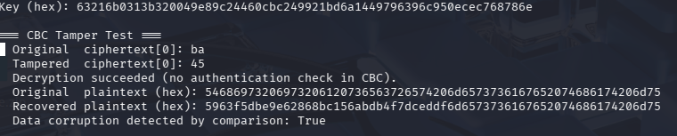
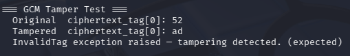

# Lab 3 — Symmetric Encryption: Block Ciphers, IND-CPA, AEAD & Cryptographic Failures

**Course:** CSCI/CSCY 4407 — Security & Cryptography
**Semester:** Spring 2026
**Date:** [DATE]
**Group Members:** [NAMES]

---

## Task 1 — ECB Distinguisher (15 pts)

### Source Code

```python
# [PASTE ECB ENCRYPTION + DISTINGUISHER CODE HERE]
```

### Repeated Ciphertext Block Evidence

[INSERT SCREENSHOT: Ciphertext output showing duplicate 16-byte blocks for P0 (repeated plaintext)]

```
# [PASTE HEX OUTPUT OR BLOCK COMPARISON HERE]
```

### Trial Results Table (≥ 20 Trials)

| Trial | b (chosen) | b' (guessed) | Correct? |
|-------|-----------|--------------|----------|
| 1     |           |              |          |
| 2     |           |              |          |
| 3     |           |              |          |
| 4     |           |              |          |
| 5     |           |              |          |
| 6     |           |              |          |
| 7     |           |              |          |
| 8     |           |              |          |
| 9     |           |              |          |
| 10    |           |              |          |
| 11    |           |              |          |
| 12    |           |              |          |
| 13    |           |              |          |
| 14    |           |              |          |
| 15    |           |              |          |
| 16    |           |              |          |
| 17    |           |              |          |
| 18    |           |              |          |
| 19    |           |              |          |
| 20    |           |              |          |

### Success Rate and Advantage

**Number of correct guesses:** [X / 20]

**Success Rate:** [X / 20 = X%]

**IND-CPA Advantage:**

```
Adv_IND-CPA = |Pr[b' = b] - 1/2| = [VALUE]
```

### Explanation: Why ECB Violates Semantic Security

[EXPLAIN why ECB is deterministic (C_i = E_k(P_i)) and why identical plaintext blocks always produce identical ciphertext blocks. Explain why this pattern leakage means an adversary can distinguish encryptions of different messages, and therefore ECB fails IND-CPA.]

---

## Task 2 — CBC IV Experiment (15 pts)

### Source Code

```python
# [PASTE CBC ENCRYPTION/DECRYPTION CODE WITH PKCS#7 PADDING HERE]
```

### Evidence: Fresh IV → Different Ciphertext

[INSERT SCREENSHOT: Two encryptions of the same plaintext under different IVs producing different ciphertexts]

```
# [PASTE SHA-256 HASHES OF BOTH CIPHERTEXTS HERE — THEY SHOULD DIFFER]
SHA-256(C_fresh_1): [HASH]
SHA-256(C_fresh_2): [HASH]
```

### Evidence: Reused IV → Linkability

[INSERT SCREENSHOT: Two encryptions under the same IV producing the same or linkable ciphertext]

```
# [PASTE SHA-256 HASHES OF BOTH CIPHERTEXTS HERE — THEY SHOULD MATCH]
SHA-256(C_reused_1): [HASH]
SHA-256(C_reused_2): [HASH]
```

### Decryption Verification (SHA-256)

```
SHA-256(original plaintext): [HASH]
SHA-256(decrypted plaintext): [HASH]
Match: [YES/NO]
```

### Explanation: Why a Fresh IV Is Required

[EXPLAIN that CBC chains each block as C_i = E_k(P_i XOR C_{i-1}) with C_0 = IV. If the IV is reused with the same key and same plaintext, the ciphertext is identical — leaking that the same message was sent. Even with different plaintexts, a reused IV allows an attacker to detect when the first block is the same. A fresh random IV per encryption ensures ciphertexts are unlinkable and semantically secure.]

---

## Task 3 — CTR Implementation (10 pts)

### Source Code

```python
# [PASTE CTR ENCRYPTION/DECRYPTION CODE HERE]
```

### Key and Nonce Details

| Parameter | Size | Value |
|-----------|------|-------|
| Key       | [X bits] | [HEX] |
| Nonce     | [X bytes] | [HEX] |
| Test file | 4096 bytes | — |

### Encryption and Decryption Output

[INSERT SCREENSHOT: Script run showing encryption and decryption of the 4096-byte test file]

### SHA-256 Hash Verification

```
SHA-256(original file):   [HASH]
SHA-256(decrypted file):  [HASH]
Match: [YES/NO]
```

### Explanation: Why CTR Behaves Like a Stream Cipher

[EXPLAIN that CTR generates a keystream by encrypting successive counter values: K_i = E_k(Nonce || Counter_i). The plaintext is XORed with this keystream, making encryption and decryption identical operations. No padding is required and blocks can be processed in parallel since each block's keystream is independent.]

---

## Task 4 — CTR Nonce Reuse Attack (20 pts)

### Group Ciphertext Package

**Group number:** 10
**Files used:** [LIST FILENAMES FROM GROUP PACKAGE]

### XOR Script

```python
# [PASTE SCRIPT USED TO COMPUTE C1 XOR C2 HERE]
```

### XOR Output Evidence

[INSERT SCREENSHOT: xxd or strings output on X = C1 XOR C2]

```
# [PASTE RELEVANT HEX/STRING OUTPUT OF X = C1 XOR C2 HERE]
```

### Recovered Plaintext (≥ 20 bytes via Crib Dragging)

| Offset | Crib Used | Recovered Text |
|--------|-----------|----------------|
| [OFFSET] | [WORD] | [RECOVERED SEGMENT] |
| [OFFSET] | [WORD] | [RECOVERED SEGMENT] |
| [OFFSET] | [WORD] | [RECOVERED SEGMENT] |
| [OFFSET] | [WORD] | [RECOVERED SEGMENT] |
| [OFFSET] | [WORD] | [RECOVERED SEGMENT] |

**Total bytes recovered:** [≥ 20]

### Explanation of Keystream Reuse

**Violated assumption: nonce uniqueness** — CTR mode is secure only when every (key, nonce) pair is used for exactly one encryption; reusing the same nonce with the same key directly violates this assumption and renders the scheme insecure.

[EXPLAIN that when the same nonce is reused in CTR mode with the same key, both ciphertexts are encrypted with the identical keystream K. XORing them cancels K entirely: C1 XOR C2 = (P1 XOR K) XOR (P2 XOR K) = P1 XOR P2. This reduces the problem to breaking a two-time pad, which can be solved by crib dragging.]

### Mathematical Explanation of Two-Time Pad Failure

[EXPLAIN formally that in the one-time pad / CTR model, security requires the key (keystream) to be used only once. When reused: C1 = P1 XOR K, C2 = P2 XOR K → C1 XOR C2 = P1 XOR P2. The key is eliminated, and any known or guessable structure in P1 or P2 can be exploited to recover both plaintexts.]

---

## Task 5 — Birthday Attack on CTR (15 pts)

### Source Code

```python
# [PASTE COLLISION SIMULATION SCRIPT HERE]
# Uses small nonce size (e.g. r = 16 bits)
# Generates random nonce per encryption
# Records number of encryptions until first nonce collision
```

### Nonce Size Used

**r =** [e.g., 16 bits]
**Theoretical birthday bound:** q ≈ 1.2 × 2^(r/2) ≈ [VALUE]

### Collision Experiment Results (≥ 20 Runs)

| Run | Encryptions Until Collision |
|-----|-----------------------------|
| 1   |                             |
| 2   |                             |
| 3   |                             |
| 4   |                             |
| 5   |                             |
| 6   |                             |
| 7   |                             |
| 8   |                             |
| 9   |                             |
| 10  |                             |
| 11  |                             |
| 12  |                             |
| 13  |                             |
| 14  |                             |
| 15  |                             |
| 16  |                             |
| 17  |                             |
| 18  |                             |
| 19  |                             |
| 20  |                             |

**Average collision point:** [VALUE]

### Comparison to Theoretical Birthday Bound

| Metric | Value |
|--------|-------|
| r (nonce bits) | [VALUE] |
| Theoretical bound (1.2 × 2^(r/2)) | [VALUE] |
| Observed average | [VALUE] |
| Difference | [VALUE] |

[BRIEFLY DISCUSS whether observed average aligns with the theoretical bound and any deviation]

### Collision Enabling Two-Time Pad Demonstration

[INSERT SCREENSHOT OR OUTPUT: Showing that the two colliding-nonce ciphertexts XOR to P1 XOR P2]

```
# [PASTE EVIDENCE HERE]
```

### Explanation: How Nonce Collision Leads to CTR Insecurity

[EXPLAIN that because CTR generates keystream as K_i = E_k(Nonce || Counter_i), two encryptions sharing the same nonce produce the same keystream. A birthday collision therefore creates a two-time pad scenario where C1 XOR C2 = P1 XOR P2, allowing an attacker to recover plaintext structure. This is why nonce/counter uniqueness is a hard requirement for CTR security.]

---

## Task 6 — Integrity vs. Confidentiality (AES-GCM) (10 pts)

### Source Code

```python
"""
Task 6 — Integrity vs. Confidentiality (AES-GCM) (10 pts)
============================================================
Demonstrates the difference between confidentiality-only (CBC) and
authenticated encryption (GCM / AEAD).

CBC:
  - Flipping a byte in the ciphertext corrupts the corresponding plaintext block
    and causes predictable bit-flips in the NEXT block — but CBC accepts it silently.
  - No integrity guarantee: tampering is undetected.

GCM (AEAD):
  - The authentication tag T covers the entire ciphertext.
  - Any modification to the ciphertext OR the tag causes decryption to raise
    an InvalidTag exception — tampering is always detected.
"""

import os
from cryptography.hazmat.primitives.ciphers import Cipher, algorithms, modes
from cryptography.hazmat.primitives.ciphers.aead import AESGCM
from cryptography.hazmat.primitives import padding
from cryptography.hazmat.backends import default_backend
from cryptography.exceptions import InvalidTag

KEY_SIZE   = 32   # 256-bit
BLOCK_SIZE = 16
GCM_NONCE_SIZE = 12   # 96-bit recommended for GCM


# ---------------------------------------------------------------------------
# CBC helpers (PKCS#7)
# ---------------------------------------------------------------------------

def pkcs7_pad(data: bytes) -> bytes:
    padder = padding.PKCS7(BLOCK_SIZE * 8).padder()
    return padder.update(data) + padder.finalize()


def pkcs7_unpad(data: bytes) -> bytes:
    unpadder = padding.PKCS7(BLOCK_SIZE * 8).unpadder()
    return unpadder.update(data) + unpadder.finalize()


def cbc_encrypt(key: bytes, iv: bytes, plaintext: bytes) -> bytes:
    padded = pkcs7_pad(plaintext)
    cipher = Cipher(algorithms.AES(key), modes.CBC(iv), backend=default_backend())
    enc = cipher.encryptor()
    return enc.update(padded) + enc.finalize()


def cbc_decrypt(key: bytes, iv: bytes, ciphertext: bytes) -> bytes:
    cipher = Cipher(algorithms.AES(key), modes.CBC(iv), backend=default_backend())
    dec = cipher.decryptor()
    padded = dec.update(ciphertext) + dec.finalize()
    return pkcs7_unpad(padded)


def flip_byte(data: bytes, offset: int) -> bytes:
    """Flip a single byte in data at the given offset."""
    ba = bytearray(data)
    ba[offset] ^= 0xFF
    return bytes(ba)


# ---------------------------------------------------------------------------
# Task 6a: CBC tamper test
# ---------------------------------------------------------------------------

def test_cbc_tamper(key: bytes, plaintext: bytes) -> None:
    print("=== CBC Tamper Test ===")
    iv = os.urandom(BLOCK_SIZE)
    ciphertext = cbc_encrypt(key, iv, plaintext)
    tampered   = flip_byte(ciphertext, offset=0)  # flip first byte

    print(f"  Original  ciphertext[0]: {ciphertext[0]:02x}")
    print(f"  Tampered  ciphertext[0]: {tampered[0]:02x}")

    try:
        recovered = cbc_decrypt(key, iv, tampered)
        print(f"  Decryption succeeded (no authentication check in CBC).")
        print(f"  Original  plaintext (hex): {plaintext[:32].hex()}")
        print(f"  Recovered plaintext (hex): {recovered[:32].hex()}")
        print(f"  Data corruption detected by comparison: {plaintext[:32] != recovered[:32]}")
    except Exception as e:
        print(f"  Decryption raised: {e}")

    print()


# ---------------------------------------------------------------------------
# Task 6b: GCM tamper test
# ---------------------------------------------------------------------------

def test_gcm_tamper(key: bytes, plaintext: bytes) -> None:
    print("=== GCM Tamper Test ===")
    aesgcm = AESGCM(key)
    nonce  = os.urandom(GCM_NONCE_SIZE)
    ciphertext_tag = aesgcm.encrypt(nonce, plaintext, associated_data=None)
    # ciphertext_tag = ciphertext || 16-byte tag

    tampered = flip_byte(ciphertext_tag, offset=0)  # flip one byte in ciphertext

    print(f"  Original  ciphertext_tag[0]: {ciphertext_tag[0]:02x}")
    print(f"  Tampered  ciphertext_tag[0]: {tampered[0]:02x}")

    try:
        aesgcm.decrypt(nonce, tampered, associated_data=None)
        print("  ERROR: Decryption succeeded despite tampering — this should not happen.")
    except InvalidTag:
        print("  InvalidTag exception raised — tampering detected. (expected)")
    except Exception as e:
        print(f"  Unexpected exception: {e}")

    print()


# ---------------------------------------------------------------------------
# Main
# ---------------------------------------------------------------------------

if __name__ == "__main__":
    key       = os.urandom(KEY_SIZE)
    plaintext = b"This is a secret message that must not be tampered with!" * 2

    print(f"Key (hex): {key.hex()}\n")

    test_cbc_tamper(key, plaintext)
    test_gcm_tamper(key, plaintext)

    print("=== Summary ===")
    print("  CBC: accepts tampered ciphertext — corrupts plaintext silently (no integrity).")
    print("  GCM: rejects tampered ciphertext — raises InvalidTag (AEAD = confidentiality + integrity).")

```

### CBC Tamper Evidence



```
=== CBC Tamper Test ===
  Original  ciphertext[0]: ba
  Tampered  ciphertext[0]: 45
  Decryption succeeded (no authentication check in CBC).
  Original  plaintext (hex): 54686973206973206120736563726574206d6573736167652074686174206d75
  Recovered plaintext (hex): 5963f5dbe9e62868bc156abdb4f7dceddf6d6573736167652074686174206d75
  Data corruption detected by comparison: True

```

**Observation:** CBC accepted the tampered ciphertext and still decrypted, producing corrupted plaintext without any authentication error. This shows CBC provides confidentiality but not integrity.

### GCM Tamper Evidence

[INSERT SCREENSHOT: Flip 1 byte in GCM ciphertext or tag → decryption fails with authentication error]

```
=== GCM Tamper Test ===
  Original  ciphertext_tag[0]: 52
  Tampered  ciphertext_tag[0]: ad
  InvalidTag exception raised — tampering detected. (expected)

```

**Observation:** AES-GCM rejected the tampered ciphertext by failing authentication and raising an InvalidTag error. No plaintext was returned, demonstrating integrity protection.

### Comparison: Confidentiality vs. Integrity

Confidentiality ensures that an attacker cannot learn the plaintext without the secret key. Integrity ensures that an attacker cannot modify the ciphertext without the receiver detecting that modification.

In AES-CBC mode, encryption provides confidentiality by transforming plaintext blocks into ciphertext blocks. However, CBC does not authenticate the ciphertext. As demonstrated above, flipping a single byte in the ciphertext caused the first plaintext block to become corrupted, yet decryption still succeeded without any error. This shows that CBC does not provide integrity — tampering may go undetected and result in corrupted but accepted plaintext.

In contrast, AES-GCM is an AEAD (Authenticated Encryption with Associated Data) mode. It produces both ciphertext and an authentication tag T that covers the entire ciphertext (and any associated data). During decryption, this tag is verified. If any bit of the ciphertext or tag is modified, decryption fails and returns ⊥ (represented here by an InvalidTag exception). Therefore, AES-GCM provides both confidentiality and integrity.

In practice, encryption without authentication (such as CBC alone) is insufficient for secure systems. Modern cryptographic standards recommend using AEAD modes like AES-GCM to ensure both secrecy and tamper detection.

---

## Task 7 — Performance Benchmarking (10 pts)

### Source Code

```python
# [PASTE BENCHMARKING SCRIPT HERE]
# Measures encrypt + decrypt times for ECB, CBC, CTR, GCM
# Each (mode, file size) combination is repeated 5 times and averaged to reduce timing variance
```

### Results Table

| File Size | Mode | Avg Enc Time (s) | Avg Dec Time (s) |
|-----------|------|-----------------|-----------------|
| 1 KB      | ECB  |                 |                 |
| 1 KB      | CBC  |                 |                 |
| 1 KB      | CTR  |                 |                 |
| 1 KB      | GCM  |                 |                 |
| 1 MB      | ECB  |                 |                 |
| 1 MB      | CBC  |                 |                 |
| 1 MB      | CTR  |                 |                 |
| 1 MB      | GCM  |                 |                 |
| 10 MB     | ECB  |                 |                 |
| 10 MB     | CBC  |                 |                 |
| 10 MB     | CTR  |                 |                 |
| 10 MB     | GCM  |                 |                 |

### Performance Analysis

[PARAGRAPH 1 — DISCUSS:
- CBC sequential chaining: each block depends on the previous ciphertext block, so encryption cannot be parallelized. Decryption can be parallelized since C_{i-1} is known.
- CTR and GCM parallelism: both generate keystream blocks independently (E_k(Nonce || i)), so encryption and decryption are fully parallelizable and typically faster than CBC at scale.
- ECB speed vs. insecurity: ECB is the fastest mode (no chaining, fully parallel) but is cryptographically broken for most real-world use cases due to pattern leakage.]

[PARAGRAPH 2 — DISCUSS:
- GCM authentication overhead: AES-GCM adds a GHASH computation over the ciphertext to produce the authentication tag, which introduces a small but measurable overhead compared to pure CTR. Discuss whether this overhead is visible in your results and whether it is worthwhile given the integrity guarantees.]

---

## Key Lessons Learned

- [SUMMARIZE key takeaway about ECB and why determinism breaks semantic security]
- [SUMMARIZE key takeaway about IV/nonce freshness in CBC and CTR]
- [SUMMARIZE key takeaway about nonce reuse leading to two-time pad attacks in CTR]
- [SUMMARIZE key takeaway about the birthday bound and nonce space sizing]
- [SUMMARIZE key takeaway about AEAD and why confidentiality alone is insufficient]
- [SUMMARIZE key takeaway about the performance trade-offs between modes]

---

## Appendix

### Full Script Listings

[OPTIONAL: Include complete script code if not fully shown in task sections above]

### Additional Screenshots

[OPTIONAL: Include any additional supporting terminal output or evidence]
